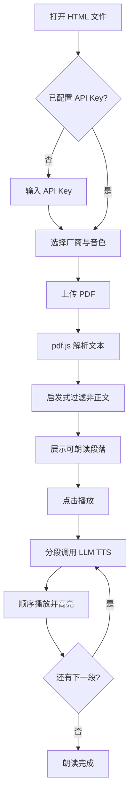

## 1. 产品概述

PDF 语音朗读程序是一款跨平台 Web 应用,用户在任意操作系统的浏览器中打开单个 HTML 文件即可使用。程序通过大语言模型(LLM)的语音合成能力将 PDF 正文内容转为自然人声朗读,自动识别并跳过目录、注脚、注示等非正文内容。界面采用苹果官网风格的极简设计。

- 解决问题:用户长时间阅读 PDF 易疲劳,需要高质量自然语音朗读;市面 TTS 工具声音机械,且不能智能识别正文
- 目标用户:学生、研究人员、知识工作者、视障辅助人群
- 价值:一键上传 PDF,自由切换 LLM 厂商与人声,获得类真人朗读体验

## 2. 核心功能

### 2.1 用户角色

无需注册登录,所有功能对访客开放。

### 2.2 功能模块

1. **朗读主界面**:PDF 上传区、正文预览、播放控制、厂商与音色切换、API Key 配置
2. **设置抽屉**:API Key 管理、默认朗读参数、跳过规则开关

### 2.3 页面详情

| 页面名称 | 模块名称 | 功能描述 |
|---------|---------|---------|
| 朗读主界面 | 上传区 | 拖拽或点击上传 PDF,显示文件名与页数 |
| 朗读主界面 | 正文预览 | 显示过滤后的正文文本,高亮当前朗读段落 |
| 朗读主界面 | 播放控制 | 播放/暂停、上一段、下一段、语速、进度条 |
| 朗读主界面 | 厂商选择 | OpenAI / Azure / MiniMax / 火山引擎 / ElevenLabs 切换 |
| 朗读主界面 | 音色选择 | 根据所选厂商展示对应人声列表(男/女/不同风格) |
| 朗读主界面 | API Key 配置 | 安全输入框,本地存储,支持显示/隐藏 |
| 设置抽屉 | 跳过规则 | 目录/注脚/注示/页眉页脚/参考文献 开关 |
| 设置抽屉 | 默认参数 | 默认厂商、默认音色、默认语速 |

## 3. 核心流程

用户打开 HTML 文件 → 配置 LLM 厂商与 API Key → 上传 PDF → 程序用 pdf.js 解析全文 → 通过启发式规则识别并过滤非正文内容 → 展示可朗读正文 → 用户选择音色 → 点击播放 → 程序分段调用 LLM TTS API → 顺序播放音频并高亮当前段落。

## 4. 用户界面设计

### 4.1 设计风格

- 主色调:纯白背景 (#ffffff) + 深灰文字 (#1d1d1f),苹果官网经典配色
- 次要色:苹果蓝 (#0071e3) 作为主操作色,浅灰 (#f5f5f7) 作为分区背景
- 按钮风格:圆角 (12px)、扁平、悬停轻微渐变,无 3D 阴影
- 字体:SF Pro Display / -apple-system 系统字体栈,标题 48px 半粗,正文 17px
- 布局:顶部细长导航栏,主内容居中最大宽度 980px,大量留白
- 图标:线性极简 SVG,1.5px 描边
- 动效:淡入淡出过渡 (cubic-bezier),段落高亮柔和过渡

### 4.2 页面设计概述

| 页面名称 | 模块名称 | UI 元素 |
|---------|---------|---------|
| 朗读主界面 | 顶部导航栏 | 左侧产品名 "PDF Voice"、右侧设置图标,半透明背景毛玻璃 |
| 朗读主界面 | Hero 区 | 大标题"聆听你的 PDF",副标题,上传卡片 |
| 朗读主界面 | 正文预览 | 卡片式容器,段落间距 1.6em,当前段落浅蓝背景 |
| 朗读主界面 | 控制条 | 底部固定悬浮条,毛玻璃背景,圆按钮组 |
| 朗读主界面 | 厂商音色 | 下拉选择器,苹果风格 segmented control |
| 设置抽屉 | 右侧滑出 | 半透明遮罩,卡片分组,开关组件 |

### 4.3 响应式设计

桌面优先(最大宽度 980px 居中),平板自适应(768px 断点收窄),移动端(375px)将控制条改为底部全宽,正文预览去掉卡片边距。

### 4.4 3D 场景

不适用。
