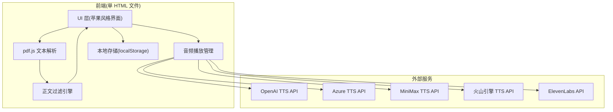
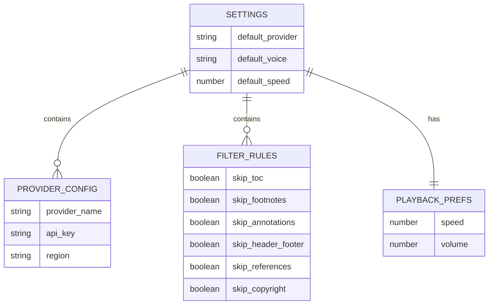

## 1. 架构设计



## 2. 技术说明

- 前端:单个 `index.html` 文件(内嵌 CSS + 原生 JS,无构建步骤)
- PDF 解析:pdf.js v3.11.174 通过 CDN 引入
- 音频播放:Web Audio API + HTML5 Audio
- 本地存储:localStorage 保存 API Key 与偏好设置
- 后端:无(纯前端,直接调用各 LLM 厂商 TTS REST API)
- 数据库:无
- 部署:无需部署,用户双击 HTML 文件即可在浏览器打开

### 2.1 厂商与音色配置

| 厂商 | API 端点 | 音色 |
|------|---------|------|
| OpenAI | https://api.openai.com/v1/audio/speech | alloy, echo, fable, onyx, nova, shimmer |
| Azure | https://{region}.tts.speech.microsoft.com | zh-CN-XiaoxiaoNeural, zh-CN-YunxiNeural 等 |
| MiniMax | https://api.minimax.chat/v1/t2a_v2 | male-qn-qingse, female-shaonv, male-qn-jingying 等 |
| 火山引擎 | https://openspeech.bytedance.com/api/v1/tts | zh_female_wanwanxiong, zh_male_M392_conversation 等 |
| ElevenLabs | https://api.elevenlabs.io/v1/text-to-speech | Rachel, Domi, Antoni, Bella, Josh 等 |

### 2.2 正文过滤启发式规则

1. **目录识别**:连续多行包含"....."或"……"且以页码结尾 → 跳过
2. **注脚识别**:行首为 `[1]`、`①`、`*`、`†` 或数字+`.` 上标形式 → 跳过
3. **注示识别**:段落以"注:"、"注释:"、"Note:"、"注解:"开头 → 跳过
4. **页眉页脚**:每页首尾短行且重复出现 → 跳过
5. **参考文献**:以"参考文献"、"References" 开头的章节至文末 → 跳过
6. **版权页**:包含"版权所有"、"Copyright"、"All rights reserved" → 跳过

## 3. 路由定义

单页应用,无路由。所有交互在同一页面内通过显隐切换。

## 4. API 定义

前端直接调用各厂商 TTS REST API,请求格式遵循各厂商官方规范。封装统一抽象层:

```typescript
interface TTSProvider {
  name: string;
  voices: Voice[];
  synthesize(text: string, voiceId: string, options: TTSOptions): Promise<Blob>;
}
```

## 5. 服务器架构

不适用(纯前端应用)。

## 6. 数据模型

### 6.1 数据模型定义



### 6.2 本地存储结构

```javascript
// localStorage 键
"pdfvoice.settings" = {
  default_provider: "openai",
  default_voice: "nova",
  default_speed: 1.0,
  api_keys: {
    openai: "sk-...",
    azure: "...",
    minimax: "...",
    volc: "...",
    elevenlabs: "..."
  },
  filter_rules: {
    skip_toc: true,
    skip_footnotes: true,
    skip_annotations: true,
    skip_header_footer: true,
    skip_references: true,
    skip_copyright: true
  }
}
```
