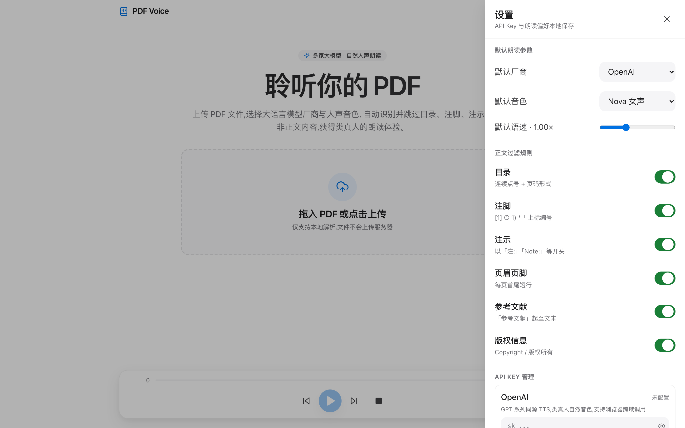

# PDF Voice Reader

跨平台 PDF 语音朗读程序,使用大语言模型 TTS 实现高自然人声朗读,自动识别并跳过目录、注脚、注示等非正文内容。




## 功能特性

- 5 家 TTS 厂商任选:OpenAI / Azure / MiniMax / 火山引擎 / ElevenLabs
- 多种音色切换(男女声、不同风格)
- 可调语速
- 自动识别并跳过非正文内容:目录、注脚、注示、页眉页脚、参考文献、版权页
- 智能段落续接:跨页段落自动合并,软换行不被错误切段
- 分段高亮:当前朗读段落实时高亮
- 上/下一段、暂停/恢复、停止
- 苹果风格简洁 UI,拖拽上传 PDF

## 快速开始

### 方式一:开发者本地运行

```bash
npm install
npm run dev
```

打开浏览器访问 http://localhost:5173

### 方式二:非开发者直接使用

仓库已包含 `dist/` 构建产物,无需安装 Node.js:

1. 下载本仓库(Code → Download ZIP)
2. 解压后双击 `dist/index.html` 用浏览器打开即可

> 推荐 Chrome / Edge / Safari 最新版本

## 配置 TTS 厂商

程序不需要注册账户,只需在右上角 ⚙️ 设置中填入对应厂商的 API Key:

| 厂商 | 是否需要 GroupId | 是否需要 Region | 浏览器直连 |
| --- | --- | --- | --- |
| OpenAI | 否 | 否 | 支持 |
| Azure | 否 | 是 | 支持 |
| MiniMax | 是 | 否 | 可能需要代理 |
| 火山引擎 | 否(格式 `APP_ID:TOKEN`) | 否 | 可能需要代理 |
| ElevenLabs | 否 | 否 | 支持 |

## 技术栈

- React + TypeScript + Vite
- Tailwind CSS
- Zustand(状态管理)
- pdfjs-dist(PDF 文本抽取)

## 截图工具

```bash
npm i -D puppeteer-core
node scripts/screenshot.cjs
```

会自动在 `screenshots/` 目录下生成 `home.png` 和 `settings.png`。

## License

MIT
