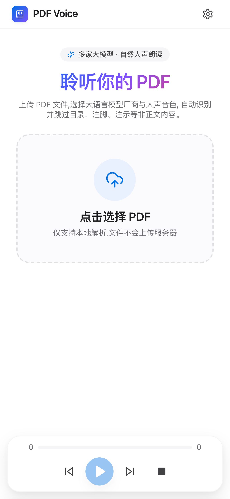
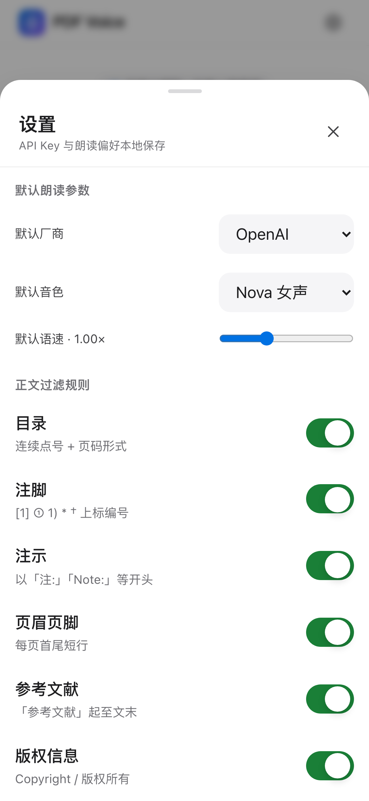

# PDF Voice Reader

跨平台 PDF 语音朗读程序,使用大语言模型 TTS 实现高自然人声朗读,自动识别并跳过目录、注脚、注示等非正文内容。






## 功能特性

- 5 家 TTS 厂商任选:OpenAI / Azure / MiniMax / 火山引擎 / ElevenLabs
- 多种音色切换(男女声、不同风格)
- 可调语速
- 自动识别并跳过非正文内容:目录、注脚、注示、页眉页脚、参考文献、版权页
- 智能段落续接:跨页段落自动合并,软换行不被错误切段
- 分段高亮:当前朗读段落实时高亮
- 上/下一段、暂停/恢复、停止
- iOS 18 风格 UI:浮岛卡片、底部 sheet、毛玻璃质感、动态渐变
- **跨平台**:Web / Android APK 通用代码

## 下载安装

### Android APK(直接安装)

1. 前往 [Releases](https://github.com/Josslao/pdf-voice-reader/releases) 下载最新 `PDFVoice-v1.0.apk`
2. 手机「设置 → 安全 → 允许未知来源」打开
3. 点击 APK 文件安装
4. 启动后,在右上角 ⚙️ 设置中填入 TTS 厂商 API Key 即可使用

> APK 体积约 5 MB,支持 Android 7.0+(minSdk 24,targetSdk 36)

### Web 浏览器使用

#### 开发者本地运行
```bash
npm install
npm run dev
```
打开浏览器访问 http://localhost:5173

#### 非开发者直接使用
仓库已包含 `dist/` 构建产物,无需安装 Node.js:
1. 下载本仓库(Code → Download ZIP)
2. 解压后双击 `dist/index.html` 用浏览器打开即可

> 推荐 Chrome / Edge / Safari 最新版本

## 配置 TTS 厂商

程序不需要注册账户,只需在右上角 ⚙️ 设置中填入对应厂商的 API Key:

| 厂商 | 是否需要 GroupId | 是否需要 Region | Web 浏览器 | Android APK |
| --- | --- | --- | --- | --- |
| OpenAI | 否 | 否 | ✅ 支持 | ✅ 支持 |
| Azure | 否 | 是 | ✅ 支持 | ✅ 支持 |
| MiniMax | 是 | 否 | ⚠️ 可能需代理 | ✅ 支持(原生 HTTPS) |
| 火山引擎 | 否(格式 `APP_ID:TOKEN`) | 否 | ⚠️ 可能需代理 | ✅ 支持(原生 HTTPS) |
| ElevenLabs | 否 | 否 | ✅ 支持 | ✅ 支持 |

> Android APK 已通过 `network_security_config.xml` 配置允许所有 TTS 厂商域名直连。

## 从源码构建 APK

需要本机已装好 Android Studio(包含 Android SDK + JBR)。

```bash
# 1. 安装依赖
npm install

# 2. 同步 web 资源到 Android 项目
npm run cap:sync

# 3. 构建 debug APK
npm run apk:debug

# 输出: android/app/build/outputs/apk/debug/app-debug.apk
```

如果需要 release 签名版,需要先生成 keystore:
```bash
keytool -genkey -v -keystore release.keystore -alias pdfvoice -keyalg RSA -keysize 2048 -validity 10000
# 然后修改 android/app/build.gradle 添加 signingConfigs
npm run apk:release
```

## 技术栈

- **前端**:React + TypeScript + Vite + Tailwind CSS
- **状态管理**:Zustand
- **PDF 解析**:pdfjs-dist
- **移动端封装**:Capacitor 8
- **Android 构建**:Gradle 8.14 + AGP 8.13 + Android SDK 36

## 项目结构

```
.
├── src/                    # React 前端源码
│   ├── components/         # UI 组件
│   ├── hooks/              # useAudioPlayer 等
│   └── lib/                # TTS 抽象层、PDF 解析、状态管理
├── android/                # Capacitor 生成的 Android 工程
│   └── app/
│       ├── src/main/
│       │   ├── assets/public/    # 同步过来的 web 资源
│       │   ├── java/             # MainActivity
│       │   └── res/              # 应用图标、字符串、网络安全配置
│       └── build.gradle
├── dist/                   # 前端构建产物(可直接打开 index.html)
├── release/                # 最终 APK
├── screenshots/            # README 展示用截图
└── scripts/                # 截图与测试脚本
```

## License

MIT
